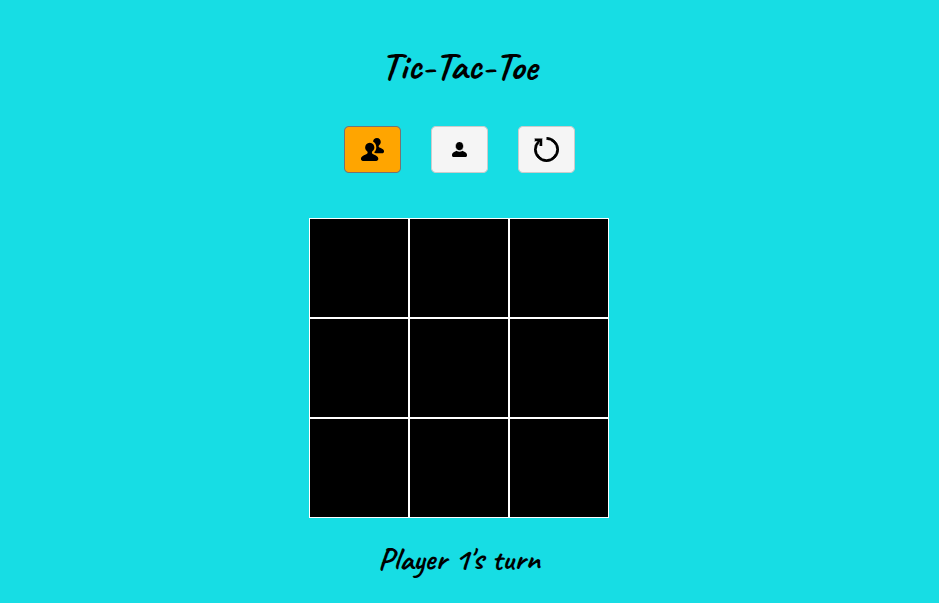
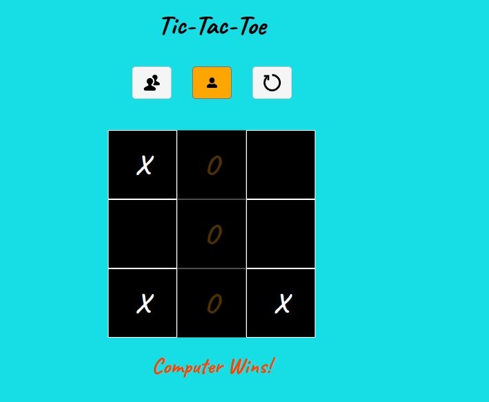

# Tic-Tac-Toe

## 🎮 Tic-Tac-Toe - Web-Based Game

```
HTML | CSS | JavaScript | License: MIT
```

---

## 🔗 Live Demo

[Play Tic-Tac-Toe Now](#)

---

## 🧩 About

Welcome to Tic-Tac-Toe, a fun and interactive web-based implementation of the classic game.
This project offers a seamless, easy-to-use interface with two gameplay modes:

✅ **Player vs Player** - Two players take turns playing on the same device.
✅ **Player vs Computer** - The computer plays with basic random moves.

🎯 The game features a **responsive design, accessible controls, and visual enhancements** like a flickering effect for winning combinations.
🔄 Players can restart the game at any time using the reset button.

---

## 🚀 Features

```
✅ Game Modes - Play against a friend or challenge the computer.
✅ Winning Combination Highlight - Winning cells flicker for better visibility.
✅ Responsive & Accessible - Works on all devices with ARIA labels and hover effects.
✅ Reset Option - Restart the game anytime with a single click.
```

---
## 📸 Screenshots

### Game Board


### Winning Combination Highlight


---

## 🛠️ Installation

To run Tic-Tac-Toe on your local machine, follow these steps:

1️⃣ Clone the repository:
   ```sh
   git clone https://github.com/yourusername/tic-tac-toe.git
   ```
2️⃣ Open `index.html` in any modern browser.
3️⃣ Choose a game mode (Player vs Player or Player vs Computer).
4️⃣ Click on a cell to start playing.
5️⃣ The game status updates below the board.
6️⃣ Click "Reset" to restart the game.

---

## 🤝 Contributing

Contributions are welcome! If you find a bug or have a feature suggestion, please open an issue or submit a pull request.

---

## 📜 License

Tic-Tac-Toe is released under the MIT License.

---

🎉 **Enjoy playing Tic-Tac-Toe!**

